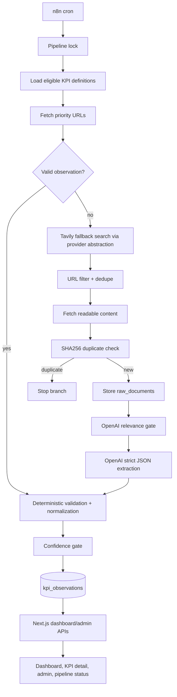

# BP-0001: MVP architecture and build plan

## Approach
Build the MVP as a single Next.js + TypeScript application with PostgreSQL as the durable data store, Prisma migrations as the schema authority, Auth.js for login and roles, and n8n as the ingestion orchestrator. The web app owns user-facing pages, API contracts, schema migrations, seeds, role checks, deterministic validation/normalization helpers, and dashboard data shaping. n8n owns scheduled execution, pipeline locking flow, per-node retries, and external fetch/AI orchestration.

The ingestion path should prefer configured KPI `source_urls`. If priority sources fail to yield a valid observation, n8n calls the app's provider-backed search contract for Tavily fallback search. All AI outputs are strict JSON and pass through deterministic validation before storage. Observations remain append-only.

## Key decisions

### Application stack
Decision: Use Next.js, TypeScript, Tailwind CSS with shadcn-style components, PostgreSQL, Prisma, Auth.js, n8n, OpenAI, and Tavily.

Alternatives rejected: a separate backend service for the MVP, MySQL, Supabase Auth, and scraping search-result pages directly.

Why: The accepted stack in [D-0014](../decisions/D-0014-application-stack.md) keeps the MVP small while preserving typed schema, role-aware web pages, and a replaceable search provider.

### Schema authority
Decision: Prisma migrations are the single authoritative schema source.

Alternatives rejected: hand-maintained SQL docs and n8n-owned schema changes.

Why: The app needs typed dashboard/admin APIs and deterministic tests. Derived schema docs can be regenerated from migrations; n8n should consume the schema, not own it.

### Pipeline boundary
Decision: n8n orchestrates the ingestion workflow, while versioned TypeScript modules in the app own deterministic rules and API contracts.

Alternatives rejected: putting all business logic in n8n Function nodes, or replacing n8n with a custom worker in the MVP.

Why: n8n satisfies the SRS orchestration and retry requirements, but normalization, confidence gates, URL filtering policy, and schema writes need tests, reviewable code, and reuse by admin/status APIs.

### Search and source retrieval
Decision: Check KPI priority URLs first, then use Tavily through a configurable provider abstraction when fallback search is needed.

Alternatives rejected: hardcoded search phrases, direct search-result scraping, and coupling KPI definitions to one search vendor.

Why: This implements [D-0007](../decisions/D-0007-fallback-search-provider.md), preserves source priority from BRD-0002, and supports later provider replacement without data model churn.

### Raw document deduplication
Decision: Fetch content, compute SHA256, store raw text only if the content hash is new, then continue to AI relevance.

Alternatives rejected: storing duplicate raw documents, or running AI before dedupe.

Why: This implements [D-0009](../decisions/D-0009-raw-document-deduplication.md) and limits storage and AI costs.

### Roles and page access
Decision: Require login. `operator` can access KPI admin and pipeline status/runs; `viewer` is read-only.

Alternatives rejected: no-auth MVP and single-role access.

Why: This implements [D-0010](../decisions/D-0010-dashboard-auth-roles.md) and keeps operational controls protected.

### UI system and route source of truth
Decision: The Next.js `app/` tree is the route source of truth. Tailwind config/theme files define semantic tokens. shadcn-style components are the locked component-library pattern.

Alternatives rejected: a separately maintained route map, hardcoded visual values, and multiple component libraries.

Why: This satisfies the opted-in `page-map`, `design-tokens`, and `design-system` workflow modules.

## Boundaries & landmines
- There is no existing application code yet; implementation should scaffold conservatively and avoid generating unrelated app surfaces.
- Do not store secrets in code or commits. Required runtime secrets include database URL, Auth.js secret/provider settings, OpenAI API key, Tavily API key, and any n8n credentials.
- Do not introduce a second auth provider or component library without a new recorded decision.
- Do not put untested deterministic business rules only in n8n; rules that affect storage, normalization, confidence, URL filtering, or authorization must exist in versioned app code.
- Do not overwrite KPI observations; observation history is append-only.
- Do not add review approval/rejection actions in the MVP.

## Affected areas
- `package.json`, Next.js app scaffold, TypeScript config, lint/format/test config.
- `prisma/schema.prisma`, migration files, and seed data for initial KPI catalogue.
- `src/app/` route tree as route source of truth:
  - login/account basics
  - dashboard overview
  - KPI detail
  - KPI admin
  - pipeline status/runs
- `src/components/` shadcn-style UI primitives and app-specific components.
- `src/lib/` deterministic rules: fetch eligibility, URL filtering, hashing, normalization, confidence gates, role checks, dashboard data shaping.
- `src/server/` or equivalent API/service layer for KPI definitions, observations, pipeline status, and provider-backed search.
- `workflow/registry/` entries for created pages, components, services, validators, and API clients.
- `n8n/` workflow exports or documentation for the cron pipeline, retry settings, and environment variables.
- `docker-compose.yml` or equivalent local PostgreSQL/n8n dev services.

## Build order
1. Foundation work order: scaffold Next.js/TypeScript, Tailwind/shadcn-style setup, test/lint commands, Docker Compose for PostgreSQL/n8n, env templates, and documented dev commands.
2. Data/auth work order: Prisma schema, migrations, seed initial KPI catalogue, Auth.js login, `operator`/`viewer` roles, and protected route/API helpers.
3. Deterministic rules work order: fetch eligibility, URL filtering, hashing/dedupe, normalization, confidence gates, and focused unit tests.
4. Dashboard API work order: latest observations, KPI history, target progress, review flags, and role-protected admin/status API boundaries.
5. Dashboard UI work order: overview, KPI detail, KPI admin, pipeline status/runs, login/account basics, WCAG 2.2 AA-oriented states, and registry page entries.
6. n8n ingestion work order: cron, pipeline lock, KPI loading, priority URL fetch, Tavily fallback, OpenAI relevance/extraction, retries, and storage integration.
7. Integration hardening work order: contract tests/mocks for OpenAI/Tavily/n8n boundaries, seed/reset flow, full build/test validation plan, and documentation for operations.
